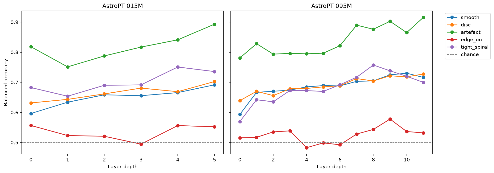
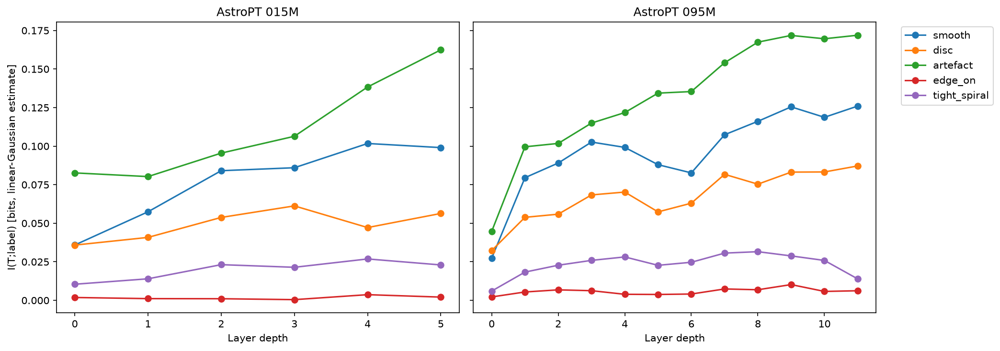
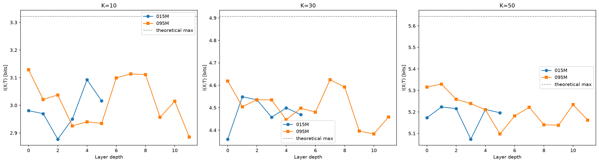
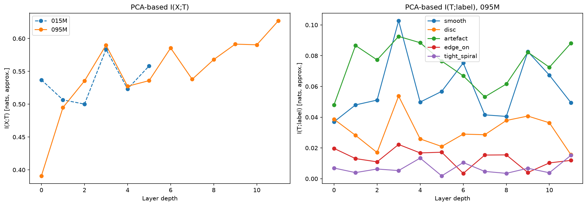
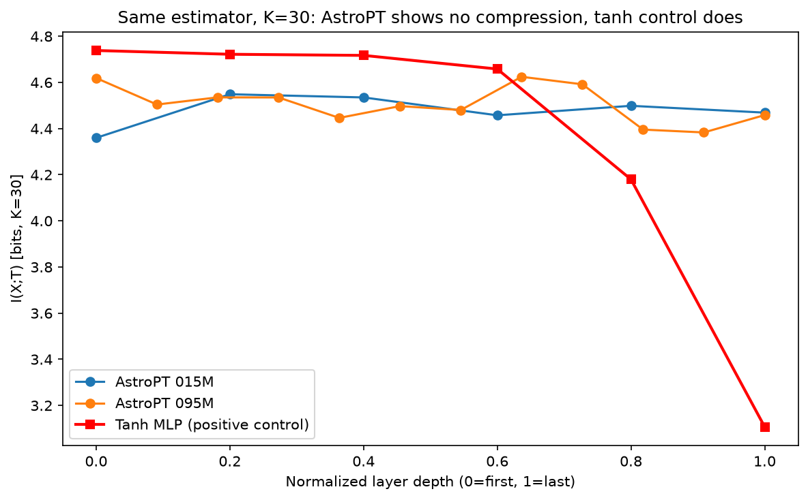
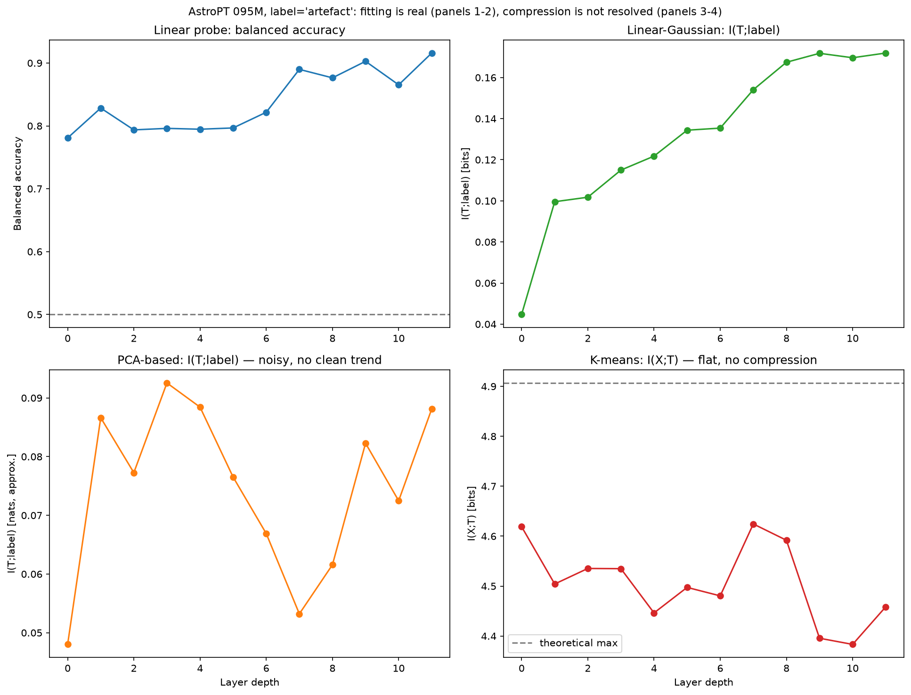

# IB-AstroPT: Information Bottleneck Dynamics Across Scale in an Astronomical Foundation Model

## Summary

This project investigates whether AstroPT — an open, GPT-2-style autoregressive transformer pretrained on 8.6 million DESI galaxy images — exhibits Information Bottleneck (IB)-style dynamics in its internal representations. Using four independent measurement methods across two model scales, we find clear, cross-validated evidence of depth-dependent representational refinement, but no evidence of the classical IB compression phase — and we validate, via a positive control, that this absence reflects a real property of the model rather than a limitation of our estimators.

## Key findings

**1. Depth-dependent fitting is real and robust.** Linear-probe accuracy and an independently-derived linear-Gaussian mutual information estimate agree closely on both the direction and shape of a rising trend across layers, for four of five morphology labels, in both model sizes tested.




**2. One label shows no depth-dependent signal at all.** Edge-on orientation sits at chance level across every layer, in both models, confirmed independently by both the probe and the linear-Gaussian estimate — see the flat red trace in the figures above.

**3. No resolvable compression signal, under three independent estimators.** K-means clustering shows flat, near-saturated I(X;T) regardless of cluster count; PCA-based estimation shows a mild, noisy trend that if anything increases with depth.




**4. A positive control confirms this is a real finding, not a blind spot.** The same K-means pipeline, applied to a small tanh-activation MLP under conditions known to produce compression (Saxe et al., 2018), shows a clear, sharp compression signature — direct evidence that the pipeline detects compression when it's genuinely present.



**5. All four methods side by side, for the strongest single-label signal.**



## Precise summary statement

> We find clear, cross-validated evidence of depth-dependent fitting — representations become progressively more informative about downstream morphology labels with depth — across two independent measurement methods and two model scales. We find no evidence of a classical Information Bottleneck compression phase under three independent mutual information estimators, and validate via a positive control that this absence reflects a genuine property of AstroPT's representations rather than a limitation of the estimation methodology. One label (edge-on orientation) shows no linearly-recoverable depth-dependent signal at all, corroborated by two methods.

## Setup

- **Model:** AstroPT v2.0 (`smith42/astropt_v2.0`), two sizes: 015M (6 layers) and 095M (12 layers)
- **Data:** 3,000 galaxies from the DESI Legacy Survey validation split (`Smith42/galaxies`), cross-matched against Galaxy Zoo DESI morphology labels ([Walmsley et al., 2023](https://doi.org/10.5281/zenodo.8360385))
- **Labels:** smooth, disc, artefact, edge-on, tight spiral (binarized at 0.5 vote fraction)
- **Methods:** linear probing, K-means discrete clustering (K=10/30/50), PCA-based continuous estimation, linear-Gaussian estimation, tanh-MLP positive control

## Repository structure

```
|- scripts/ — all analysis scripts, numbered by phase
|- data/ — local eval subset and embeddings (S3-backed, gitignored)
|- probe-results/ — linear probe accuracy results
|- mi-results/ — mutual information estimation results (all methods)
|- figures/ — final figures, versioned in git
|- docs/
  |- METHODOLOGY.md — full narrative: why each method was chosen, what each one revealed
  |- LIMITATIONS.md — honest accounting of every constraint encountered
  |- FUTURE_WORK.md — what was scoped out and why
```


For the full methodology, including why the estimator progression happened the way it did, see [`docs/METHODOLOGY.md`](docs/METHODOLOGY.md).

## Acknowledgments

Built on [AstroPT](https://github.com/Smith42/astroPT) (Smith et al., 2024) and the [Galaxy Zoo DESI](https://doi.org/10.5281/zenodo.8360385) morphology catalog (Walmsley et al., 2023). This project's information-theoretic framing draws on work in bottleneck problems and self-supervised representation learning, including Voloshynovskiy et al.'s work on information-theoretic bottleneck problems.
